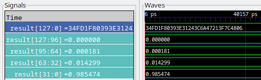
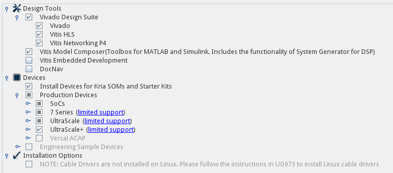
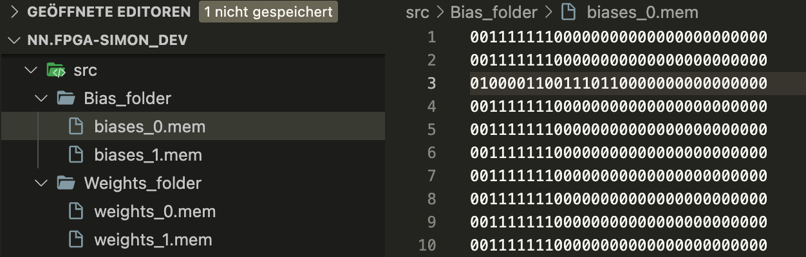

# Verilog workflow

For improved readability, storing different modules in different files

file name: ModuleName.v

in cases module contains another module, use the include construction:

```v
`include "Submodule.v"

module ModuleName()
    wire a, b;
    ...
    Submodule sub(a);
endmodule
```

problems can occur with multiple includes, submodules can get included
more than once

include works a lot like copy-paste of the submodule file contents

example: ModuleName includes SubmoduleA, SubmoduleB files

both SubmoduleA and SubmoduleB include SubmoduleC file

ModuleName contains SubmoduleC module definition twice

this causes problems in the "compilation"/synthesis process

solution... conditional block \`ifndef, \`endif

after 1st include, \_submodule macro is defined using \`define

in following include, the \`ifndef block is skipped as macro is defined

```v
`ifndef _submodule
`define _submodule

module Submodule ...

`endif // _submodule
```

Divide modules into 2 groups:

-   hardware modules... synthesizable on HW, using subset of Verilog

-   testbench modules... only for simulation, can contain anything

Nonsynthesizable Verilog elements:

-   fixed delays (#10)

-   most of the functions starting with \$ (\$display, \$monitor, ...)

    -   in Vivado, \$readmem\_ is valid and creates a RAM block from loaded data

-   certain data types (real)

## Icarus Verilog

Software for module verification, simulation

[https://github.com/steveicarus/iverilog](https://github.com/steveicarus/iverilog)

cannot check whether modules can synthesize on a real device

Usecase:

`iverilog -o ModuleName.vvp src/ModuleName.v -s ModuleName -I src/`

- -o... output file name
- -s... starting point (module name)
- -I... where to search for includes (everything from src/ directory)

Makefile is strongly recommended for automation.

Run simulation... `vvp ModuleName.vvp -lxt2`

`-lxt2`... generate more compact waveforms (binary fileformat, unlike vcd)

Display waveform (visual simulation)... GTKWave

add variable dump to the testbench file

```v
$dumpfile("vcd/ModuleName.vcd");
$dumpvars;
```

then, open created file in GTKWave

GTKWave has special way to display floats (with direct conversion to
readable value)

Right click bus (32-bit wide) -> Data Format -> BitsToReal

Problematic for wider buses (vectors/matrices of floats)

Solution - open bus -> select bits representing one number -> F4 to
group under one bus

then, smaller buses can have format changed to BitsToReal



## AMD Vivado

Available only on Win, Linux (not MacOS)

When installing, necessary to download following modules



Install Devices for Kria SOMs and Starter Kits... needed for Kria KV260
board

UltraScale+... synthesis for Kria KV260 fails without this one present

Workflow:

- Load the src directory, use these files in bd visual designs

    - join mutliple Verilog modules, set ports adequately

- Create a Verilog/VHDL wrapper for this design (automanaged), set as
    target

    - set as target = select module as the one to be simulated/synthesized

    - sometimes different targets for simulation and synthesis

    - Simulation (RMB) -> Simulation settings... -> Simulation top module name

- Test design in simulation (not device dependent)

- Run synthesis, connect correct ports (clock, any inputs/outputs)

- Rerun synthesis (automatic), run implementation

- generate bitstream, upload to connected target (physical device)

    - target connection... either by USB/UART cable or using SSH

    - for SSH, the Kria board needs to have hw_server running

    - general SSH connection... see below

## Kria KV260 connection

It is possible to connect to this board using the SSH protocol. As the
board has both a regular ARM chip (Cortex A53, see [Zynq UltraScale+
MPSoC](https://www.xilinx.com/products/silicon-devices/soc/zynq-ultrascale-mpsoc.html))
and the FPGA array, it is running a regular Linux distribution, Ubuntu
22.04 in our case. In order to access this device remotely, it must be
connected to the TUM network (which kind people at the Big Geospatial
Data Management lab set up for us), and client must be connecting from
inside the university network, either directly on eduroam or using TUM
VPN (see [VPN - eduVPN - Installation und
Konfiguration](https://doku.lrz.de/vpn-eduvpn-installation-und-konfiguration-11491448.html)).
Our current contact person at the lab who helped us set this up is
Xuanshu Luo <xuanshu.luo@tum.de>.

As mentioned before, additional server must be running on the Kria board
in order to upload bitstream using Vivado. However, it is possible to
upload bitstream as file via scp/rsync and then run it using the ssh
connection. This method turned out to be necessary for us anyway when
mapping memory blocks on the Kria board (see below).

## Memory mapping on Kria

As the resulting modules need to interact with the memory shared between
FPGA and CPU on the Kria board, the process of uploading and running
modules on Kria board is not so straightforward. It seems that when the
identical bitstream is uploaded directly from Vivado (\"Program Device\"
button), this memory interaction on the board is not working. Following
steps are taken from this [Xilinx
example](https://xilinx.github.io/kria-apps-docs/creating_applications/2022.1/build/html/docs/vivado_accel_example.html).
(As Xilinx has the tendency to remove older online resources, in case
previous link doesn't work, [try
this](http://web.archive.org/web/20240117153005/https://xilinx.github.io/kria-apps-docs/creating_applications/2022.1/build/html/docs/vivado_accel_example.html))

### **Prerequisites**

-   Vivado (design modelling, .bit.bin bitstream, .xsa design file)

-   Vitis (package contains XSCT shell, needed for generating .dtsi HW
description file, and Device Tree Compiler dtc)

-   Device Tree Generator
(DTG) [Xilinx/device-tree-xlnx - Github](https://github.com/Xilinx/device-tree-xlnx)

-   devmem or devmem2 [OSS implementation -
Github](https://github.com/radii/devmem2)

    - see our custom fork devmem2m

### **Generate bitstream (.bit.bin)**

-   Using Vivado, create a valid module and finish synthesis +
implementation

-   Settings -> Bitstream -> set -bin_file as True (only once)

-   Generate bitstream... saved as
`[project_path]/nn-fpga.runs/impl_1/[design_name]\_wrapper.bin`

-   Copy file to desired location, rename to `[app_name].bit.bin`

### **Generate binary device tree (.dtbo)**

-   In Vivado (after bitstream is generated), File -> Export -> Export
Hardware -> include bitstream

-   .xsa file is generated...
`[project_path]/nn-fpga.runs/impl_1/[design_name]\_wrapper.xsa`

-   Copy file to desired location, rename to `[app_name].xsa`

-   using xsct, run the following commands:

```sh
hsi open_hw_design $DESIGN_NAME.xsa
hsi set_repo_path $HOME/device-tree-xlnx # path to DTG
hsi create_sw_design device-tree -os device_tree -proc psu_cortexa53_0
hsi set_property CONFIG.dt_overlay true [hsi get_os]
hsi set_property CONFIG.dt_zocl true [hsi get_os]
hsi generate_target -dir temp
hsi close_hw_design [hsi current_hw_design]
exit
```

-   Directory temp has been generated that contains pl.dtsi

-   Convert pl.dtsi to `[app_name].dtbo`... `dtc -@ -O dtb -o [app_name].dtbo pl.dtsi`

-   Copy file to desired location, temp directory can be removed now

This process is partially automized by xsa2dtbo.sh script, present on
atcremers.

### **Configuration file (shell.json)**

```json
{
"shell_type" : "XRT_FLAT",
"num_slots" : "1"
}
```

### **Upload, run**

-   Upload the `[app_name].bit.bin`, `[app_name].dtbo`. and `shell.json`
files to Kria board using SSH (scp, rsync)

-   Copy these files to a newly created directory
`/lib/firmware/xilinx/[app_name]`

App should now be ready to run. This means it should be visible when
running sudo xmutil listapps. In order to run the app, use `sudo xmutil unloadapp; sudo xmutil loadapp [app_name]`.

Now, the app should be running. Using the devmem (or devmem2) command,
you should be able to access the memory of the program, assuming you
know which addresses the program maps to (this information is visible in
Vivado). Running `sudo devmem2 0xa0000000` should output the memory
contents on address `0x a000 0000`. The default accessed memory size is 1
word (8 bytes). This command can be used for writing to memory as well
as reading from it.

# Common Verilog issues, learnings

## Beware of interdependent signals

As depicted in the code snippet below, a register is declared, intended
to consistently indicate whether the inputs to the program have changed
or remained unchanged. Here, this signal is explicitly set to 0.

`reg input_changed = 1'b0; // indicates changed input in a computing cycle`

Since these first lines are not in a special block, they are executed
directly before the actual program execution begins. However, within the
Always Block in line 56, any alteration of any of the inputs triggers an
immediate setting of the input_changed signal to 1.

The issue with this framework lies in the fact that the initial
assignment of any value to inputs A, B_t, l, m, or n is directly
interpreted as a change, prompting the signal to be set to 1 at the
start of the iteration. One might mistakenly assume that this signal
remains at 0 for a certain duration as it was initialized so, without
anticipating that initializing and assigning signals for the first time
would be construed as a change. Hence, caution is advised as this could
lead to inadvertent errors due to this misinterpretation.

```v
reg done;
reg [(32 * MBUF) - 1:0] A_vector, B_vector;
reg input_changed = 1'b0; // indicates changed input in a computing cycle

// ... more code irrelevant for this example

// start computing the first output (load m numbers)

initial begin
    done = 1'b0;
    result <= 0;
    A_vector <= A[0 +: 32 * MBUF];
    B_vector <= B_T[0 +: 32 * MBUF];
end

// flip down switches when module inputs change
always @ (A, B_T, l, m, n) begin
    A_vector <= A[0 +: 32 * MBUF];
    B_vector <= B_T[0 +: 32 * MBUF];
    done <= 1'b0;
    input_changed <= 1'b1;
end
```
The main takeaway from this -- the always block gets immediately
triggered at the beginning when the input values change from X
(undefined in simulation, in practice mostly Hi-Z state) to specifically
set values. This means that the always block can rewrite anything that
was set either in the initial block or directly in the register
definition.

## Sequential evaluation of the always blocks

```v
always @(posedge vector_mult_done) begin

    result[(32* counter)+: 32] = res_scalar;

    if (input_changed) begin
        cnt_a = 0;
        cnt_b = 0;
        counter =0;
        input_changed = 1'b0;
    end

    result[(32* counter)+: 32] = res_scalar;
    counter = counter + 1;
```

The second point of learning concerns the sequence of command execution
within \'always\' blocks. The sequence of command execution within
\'always\' blocks is notably sequential, contrary to most other cases.
This becomes problematic in the code example above when a series of
multiplications has just concluded, and the following sequence of
multiplications for the next neural network layer is to be performed.
Assuming there are 10 multiplications, the counter increments up to the
value of 10. This value persists until the inputs change, triggering a
new series of computations by setting the counter back to 0.

Herein lies the issue: the statement above the if statement would be
better positioned after it, as it is already placed within the code
snippet. This adjustment is necessary because it is only after the new
computation result is written to the non-existent position 10 before the
if statement that the counter is reset. Consequently, from the second
layer onward in the neural network, the initial entry in the sequence of
computations will be incorrect. Subsequent entries remain unaffected as
they are correctly written to their respective positions, with the
counter reset back to the appropriate range. This can lead to a
hard-to-detect off-by-one error.

## Parallel evaluation

All lines of code existing outside \'always\' blocks, as previously
mentioned, are executed not sequentially but in parallel. Consequently,
the placement of functions like \'PACK_ARRAYS\' within the code example,
for instance, does not hold significance. Rather, these functions
represent a block that executes whenever the input changes. Therefore,
their order is inconsequential. However, it\'s considered poor coding
practice to redundantly place these \'pack array\' or other functions
multiple times, assuming they need to execute after each code segment.
This approach doesn\'t align with the aforementioned parallel execution
nature and lacks logical sense due to the inherent parallelism in the
code structure. An example for this "bad" style can be seen in the code
snippet below:

```v
`PACK_ARRAY(32,
MAXWEIGHTS*MAXNEURONS,weightstorage_2dim,weightstorage,PACK1);
`PACK_ARRAY(32, MAXNEURONS,biasstorage_2dim,biasstorage,PACK2);

MatrixMultiplicationFlex #( .LBUF(MAXNEURONS),

.MBUF(MAXWEIGHTS),

.NBUF(1),

.MOD_COUNT(1))

M1(

.A(weightstorage),

.B_T(data_store),

.clk(clk),

.l(neuron_cnt),

.m(input_cnt),

.n(1),

.result(mul_store),

.done(donemul));

VectorAdditionFlex #( .LBUF(MAXNEURONS))

VA1 (

.A(mul_store),

.B(biasstorage),

.clk(clk),

.l(neuron_cnt),

.prevmuldone(donemul),

.result(add_store),

.done(doneadd));

`PACK_ARRAY(32,
MAXWEIGHTS*MAXNEURONS,weightstorage_2dim,weightstorage,PACK1);

`PACK_ARRAY(32, MAXNEURONS,biasstorage_2dim,biasstorage,PACK2);

genvar i;

generate

for(i = 0; i < MAXNEURONS; i = i + 1)

Sigmoid sigmoid(.num(add_store[32 * i +: 32]),
.result(currentresult[32 * i +: 32]));

endgenerate

`PACK_ARRAY(32,
MAXWEIGHTS*MAXNEURONS,weightstorage_2dim,weightstorage,PACK1);

`PACK_ARRAY(32, MAXNEURONS,biasstorage_2dim,biasstorage,PACK2);

always @(doneadd) begin

if (layerindex >= NR_LAYERS) begin

result = currentresult;

end

else begin

\$readmemb(\$sformatf(\"%s%1d%s\", \"Weights_folder/weights\_\",
layerindex,\".mem\"), weightstorage_2dim);

\$readmemb(\$sformatf(\"%s%1d%s\", \"Bias_folder/biases\_\",
layerindex,\".mem\"),biasstorage_2dim);

layerindex = layerindex + 1;
```
## sensitivity list of always blocks

## Loading binary data using \$readmemb

### \$readmemb functionality

The \$readmemb function allows us to read contents from files and use
them within our program. It is crucial to adhere to the correct syntax
when utilizing this function. The first parameter expected by readmemb
is a valid file path. This path can be dynamically modified in compile
time to access different files. The \$sformat function enables us to
dynamically construct a name by combining integers and string fragments.
The initial parameter specifies the structure of the entire string, and
subsequent components are inserted at their respective positions,
provided they are of the appropriate type.

```v
$readmemb($sformatf("%s%1d%s", "Weights_folder/weights_", layerindex,".mem"), weightstorage_2dim);

$readmemb($sformatf("%s%1d%s", "Bias_folder/weights_", layerindex,".mem"), biasstorage_2dim);
```

The file, specified by the path, must be in the .mem format and should
contain contents only in pseudo-binary representation, that is ASCII
characters '0', '1' and newline (0x30, 0x31, 0x0a). Verilog loads
individual lines into vectors, therefore the result is a one-dimensional
array of vectors (see [Verilog Arrays and
Memories](https://www.chipverify.com/verilog/verilog-arrays-memories)).




This format makes these files unnecessarily large (32bit number is
stored in 33 bytes including newline) for the cost of increased
readability (without using tools such as hexdump). Using compression
algorithms such as gzip for long-term storage would be recommended when
working with bigger files.

A one-dimensional array of vectors must be provided to store these
contents in Verilog, as each line break prompts the \$readmemb function
to store the next line in a new vector. In this case, the \[31:0\]
determines the size of a single vector, that is floating-point number.
In a sense, that is similar to an element of an array in a conventional
programming language, which also has size bigger than one bit. An
example can be seen in the code below:

```v
reg [31:0] weightstorage_2dim [MAXWEIGHTS*MAXNEURONS-1:0];

reg [31:0] biasstorage_2dim [MAXNEURONS-1:0];
```

### Loading undefined values

The execution of the \$readmemb function happens in the compile time,
therefore no delay is observable in the simulated waveform. Therefore,
any instances of memory array assignments with undefined values (\'x\'),
as illustrated in the image below, are never attributable to waiting
periods. Instead, in such cases, it is most likely due to reading a
non-existent file (watch out for relative paths). Consequently, the
entire memory array is populated with an unknown value.


In the case of a dimension mismatch between the file and the Verilog
register, Icarus Verilog displays a warning during compilation. When the
file is too short, the array would most likely be partially initialized,
although we haven't directly tested this.

# Difference between Flex and Sequential Modules

The neural network developed by us in the course of this practical
training has three central and recurring computational steps on each
layer. These steps are applied in most neural networks. The mentioned
steps are matrix multiplication, vector addition, and non-linear
transformation through the activation function.

The Matrix multiplication step involves multiplying the inputs by the
specific weights of the neuron and then summing up all the results. As
the inputs for all neurons in a layer remain the same, strictly
speaking, this process is effectively the multiplication of a matrix
(weights) by a vector (inputs). The resulting output is a vector that
contains all the products computed across neurons. We therefore chose a
rectangle in this document section to represent the Matrix
multiplication.

The specific dimensions of the rectangle serve as an example to
illustrate the extent of matrix multiplication, representing the number
of operations (each element in the weight matrix corresponds to one
multiplication and one addition). Here, the height signifies the number
of neurons, while the length represents the number of inputs.


Possible examples of MMs:

(left: 4 neurons, each with 4 inputs)

(middle: 1 neuron with 7 inputs)

(right: 3 neurons with 1 input)

The vector addition, following the matrix multiplication, adds a bias to
the result of each individual neuron. Each neuron possesses a unique
bias based on its training. Therefore, it involves adding two vectors
through a bar notation, symbolizing this process.


Possible examples of VAs:

(left: 4 neurons and 4 Biases)

(right: 7 neuron with 7 inputs)


Lastly, the activation function takes the
vector after the biases have been added and transforms the value using
the selected function. In our example, this is represented by a circle.

Possible examples of an AF:


As a
visualization aid, green lines represent the physical connections on the
FPGA between the individual modules (MMs - Matrix Multiplications, VAs -
Vector Additions, AFs - Activation Functions).

Example of the sequential module:

The structure of our neural network in the sequential form functions in
a way where each layer is explicitly programmed. For instance, a neural
network with 10 neurons in the first layer, 25 in the second, 17 in the
third, and 5 in the last layer would look like this:


As evident from the above visualization, such an implementation requires
a significant amount of computing modules (and therefore transistors) on
the FPGA.

Exactly at this juncture, our proposed flexible implementation comes
into play. Due to the consistent and repetitive structure of the layers
in the neural network, it allows us to make drastic simplifications.
Instead of employing separate Matrix Multiplications (MM), Vector
Additions (VA), and Activation Functions (AF) for each layer, we now use
only one of each of these components for the entire neural network.

This works by determining the maximum size for each module, which may
occur at any point in the entire neural network in the time of
synthesis. Consequently, we can construct a component capable of
performing all calculations at every layer of the neural network.
Visually, it looks like this:


As one can observe, the Flex variant operates in a way that allocates
only the resources required by the components for computing the current
layer of the neural network. This results in significant transistor
savings, particularly for neural networks with many layers, each of a
similar size.

(Even though this solution could under very specific conditions increse
the amount of needed modules, for the majority of neural networks it is
indeed an improvement.)

In addition to the significant transistor savings, the prototyping time
can be drastically reduced as well. This is because, in the Verilog code
of the testbench, only the new architecture, i.e., the number of neurons
in each layer, needs to be modified within the array "neuroncount". The
largest dimensions of the neural network must be determined manually.
These dimensions are then entered into the parameters MAXRESULTS and
MAXWEIGHTS. (Of course, the appropriate weights should have already been
loaded accordingly.)

```v
`timescale 1ns / 1ps

`include \"NeuralNetworkNew.v\"

*module* [NeuralNetworkNewTB];

parameter NR_LAYERS = 2, INPUTSIZE = 4, OUTPUTSIZE = 10, MAXWEIGHTS= 4,
MAXRESULTS= 10;

reg [INPUTSIZE*32-1:0] imagedata;

reg [32*NR_LAYERS-1:0] neuroncount = {32'd10,32'd3};

wire [32*OUTPUTSIZE-1:0] result;

reg clk = 0;

always begin
    clk = ~clk;
    #1;
end

NeuralNetworkNew #(.NR_LAYERS(NR_LAYERS),

.INPUTSIZE(INPUTSIZE),

.OUTPUTSIZE(OUTPUTSIZE),

.MAXWEIGHTS(MAXWEIGHTS),

.MAXRESULTS(MAXRESULTS))

NN1 (

.inputdata(imagedata),

.neuron_count(neuroncount),

.clk(clk),

.result(result));

initial

begin

$dumpfile("NeuralNetworkNewTB.vcd");

$dumpvars(0,NeuralNetworkNewTB);

imagedata = {32'h41200000,32'h41200000,32'h41200000,32'h41200000};

#1000;

$finish;

end
endmodule
```

## Example Calculation of Transistor Reduction

Let's assume that we constructed a Neural network with the following
Neuron Counts at each layer.

Neuron-Count = {10;20;25;20;25;20;10}

Number-of-Inputs = 15

Number-of-Outputs = 10 (equals the last number in Neuron-Count)

With these numbers, we can now calculate the number of floating-point
operations required to propagate any input throughout the entire
network.

15 * 10 + 10 +10 = Number of FLOPs for the
first layer

Formula:

Dimension of current Data * Number of Neurons + Dimension of current Data for bias Addition + Dimension of current Data for Activation function

Total Number of FLOPs:
```
15*10+10+10+

10*20+20+20+

20*25+25+25+

25*20+20+20+

20*25+25+25+

25*20+20+20+

20*10+10+10 = 2810
```
For comparison, the Flex module only requires 675 FLOPs. This can be
computed with the following formula, which uses the maximal number of
neurons and max number of data points at any given moment. Since every
elementary FLOP requires roughly the same amount of transistors this new
version results in a 76% reduction in the number of needed transistors.
Since this is still a relatively flat neural network, even bigger
improvements can occur in other networks. This allows significantly
larger networks to run on the FPGA.
```
25 * 25 + 25 +25 = 675
```
Formula:

Max Dim of Data \* Max Nr of Neurons + Max Nr of Neurons + Max Nr of
Neurons


675/2810 = 0.2402

1 - 0.2402 = 0.7597


# Python Scripts for Data Transformation & Training

All mentioned scripts are located in the `Python-Scripts` subdirectory.

## Data transformation

The `MNIST-Data-Transformation.py` script is intended to provide the user with both an
understanding of the MNIST dataset and, simultaneously, transform images
from this dataset into a suitable data format. The images in the MNIST
dataset always consist of 28 by 28 pixels, each having a float value
between 0 (white) and 1 (black), which represents the brightness of the
respective pixel. This script converts these float numbers into their
binary representation and saves them in the specified file.

The script begins with all the relevant inputs. Following that is the
\"binary\" function, which converts any 32-bit floating-point number
into the correct binary representation. Subsequently, the MNIST dataset
is loaded and divided into X (features) and y (labels). These can then
be examined in various ways through the next lines, where two arbitrary
digits are shown. In the last part of the script, which starts with the
definition of the file path, the number of required transformed images
and the file path are first determined. After opening the file, each
image is iterated over, and each pixel is converted into the correct
binary representation. These are then saved in the file format described
below, and the file is completed.

The data format can be reviewed below this paragraph. In this format,
the data of the handwritten digit is always stored alongside its
corresponding correct label.
```
[[[\'00000000000000000000000000000000\',
\'00000000000000000000000000000000\',

More pixel values .............................. ,
\'00000000000000000000000000000000\',

\'00111111011111011111110111111110\',
\'00111111011111011111110111111110\',
\'00111111010001101100011011000111\'
\'00000000000000000000000000000000\'], \'5\'],

More digits ... ]

[[[784 pixels],label], next images....]
```
## NN training

The `Training_Network.py` script was used to train a neural network based on the
MNIST dataset and obtain the corresponding weights and biases. This is a
subsection of the entire script and therefore relies on the imports from
the previous script. For clarity, in the initial part of the script, the
MNIST dataset\'s data is loaded again, and the features are separated
from the labels. Next, the datasets are further divided into training
and testing sections. Subsequently, an MLPClassifier is created with a
neuron configuration matching the later neural network running on the
FPGA. The activation function \"logistic\" corresponds to the sigmoid
function. Additionally, since probabilities are desired as output, the
activation function of the output layer is set to \"softmax\".
Subsequently, all weights of all layers are stored together in one file.
The same is done for all biases.

The creation of this script was made possible through the consultation
of the SKlearn documentation and inspired by the following page
[https://johdev.com/jupyter/2020/03/02/Sklearn_MLP_for_MNIST.html](https://johdev.com/jupyter/2020/03/02/Sklearn_MLP_for_MNIST.html)

## Number formatting

```
This creates the following folder/file - structure:
NeuralNetwork
├── Weights_folder
│   ├── Weights_1
│   ├── Weights_2
│   └── ...
└── Biases_folder
    ├── Biases_1
    ├── Biases_2
    └── ...
```

The `weights_biases_formating.py` script is crucial for utilizing the Verilog Neural Network
project as it provides the weights and biases. To achieve this, it first
loads the weights and biases from the files defined in the previous
script. Subsequently, it organizes them appropriately and converts them
into binary format. Afterward, they are saved in the suitable file
format. The resulting files are then placed in the folder structure
required for the Verilog project, enabling them to be promptly utilized.

The script starts with the definitions of some utility functions, which
convert floating-point numbers into their binary format and create a
folder for the given pathname.

Next, the structure of the network must be specified. It is important to
ensure that the correct number of neurons on each layer, including both
the input and output layers, is specified.

Following that, the weight file is opened, weights are read, converted
into binary format, and appropriately stored in the \"regrouped\"
variable. The complex calculation of \"regrouped\" is necessary because
the MLPClassifier provided by SKlearn presents the weights in the wrong
order. (If you imagine the weights of all neurons in a layer as a
matrix, it needs to be transposed.) A similar, albeit simpler, process
follows for the biases, which are then saved in \"transformed_biases".

In the last part of the script, first, the parent folder and then the
subfolders for weights and biases are created. Subsequently, for each
layer of the neural network, a file is created. The weights are then
written to the file in binary format, line by line, without any
additional information, and saved with the \".mem\" extension. A
visualization of the file structure, ready for immediate use, can be
found in the comment below.

# SSH in general

If your username on the remote computer is different from your local
computer, make sure that you use the username from the remote computer
in your SSH client. Some SSH clients implicitly use the username from
the local computer per default if you don't supply a different username
explicitly.

Commonly used switches:

-   `-p [NUM]`... look for ssh server on port NUM. This is not
necessary when default port (22 for ssh) is used.

-   `-X`... enable X11 forwarding, used for running graphical applications
over ssh.
